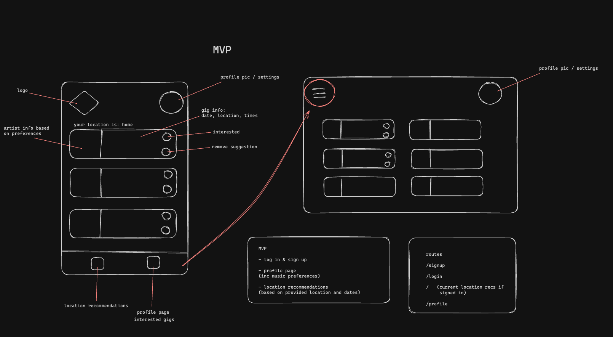
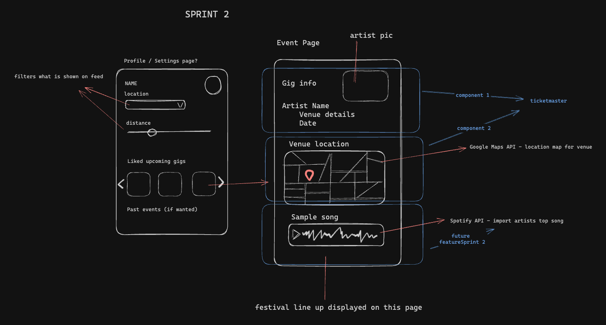

# Gig Guru

## Index

- [App Intro](#app-intro)
- [Team Learning Goals](#team-learning-goals)
- [Design Steps](#design-steps)


## App Intro
🎶 Get ready to rock with Gig Guru, your ultimate music discovery app for unforgettable experiences in the UK! Pick your favorite city, and from buzzing festivals to intimate shows, we've got your dream lineup covered. Using Gig Guru, you will never miss a beat! 🎸

Gig Guru is a music event finding app, all you have to do is input a UK city of your choice and you will be able to see upcoming music events in that area. You are able to keep track of events that interest you in your very own account section. and the event page will show you more details including the venue location so you can start planning!

## Team Learning Goals

- Create a music app with React
- Utilise external APIs, including Ticketmaster Discovery API and Google Maps API
- Practiced AGILE Team Development

## Design Steps

As a team we had big plans for what we wanted to include in our app. Using Excalidraw and Trello, we were able to prioritise and agree on the core functionality of our app and what this would look like.

Below are screenshots of our Excalidraw planning. Having this visual plan provided a reference point that we were able to revisit throughout the final project weeks. It also helped us to plan what information we would been needing from external APIs and how we would use it. 





## Reflection 

- We found the time we took to plan as a team really beneficial as it meant we were on the same page with the direction of the project. This continued throughout the 2 weeks as we had regular stand ups and retrospectives as a full team.

- Using 2 external APIs was a fun learning experience for us, although it was a challenge when it came to testing, we all agreed that we have learnt a lot from this.

- Taking time to go through the PRs and merge as a team meant that we were all able to discuss the code and understand each section of our code base. Even if it got more complicated towards the later stages, we worked to resolve merge conflicts as a team

## Set Up

```bash
# Install the dependencies
cd frontend
npm install
cd ../backend
npm install

# Run the bundler
npm run build

# Start the front and backend servers
cd frontend
npm run
cd ../backend
npm run
```

## Testing

we wrote both component and unit tests in addition to e2e testing to mock user interaction with the app.

To run the tests:

```bash
# To run the frontend tests:
cd frontend
npm run cypress:open

# To run the backend tests:
cd backend
jest
```

## Technologies Used

## Future Developments

## Team Info
